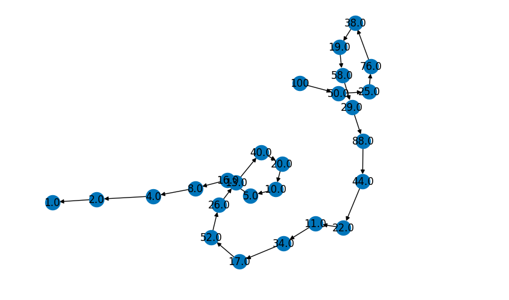

# Collatz Conjecture Visualization

## Overview
This program visualizes the sequence generated by the Collatz conjecture using a directed graph.

## Features
- Generates the Collatz sequence for a given input number.
- Visualizes the sequence as a directed graph using the NetworkX library.
- Saves the plot of the graph as an image.

## Getting Started
### Prerequisites
- Python 3.x
- NetworkX
- Matplotlib

### Installation
1. Clone the repository:
   ```bash
   git clone https://github.com/your-username/collatz-conjecture.git
